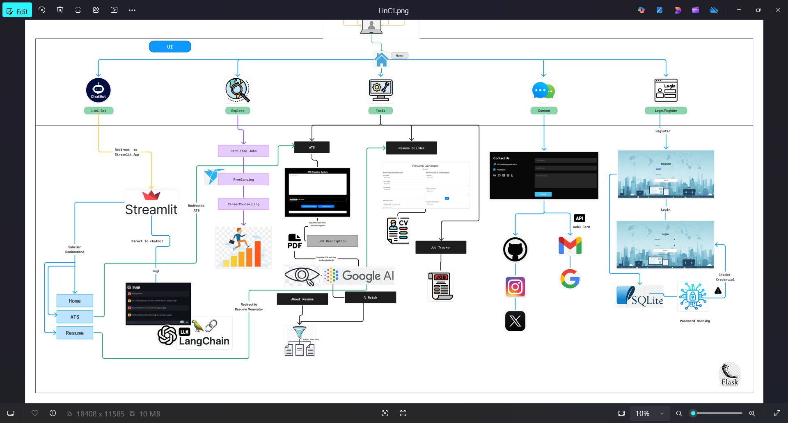

# 🚀 LinC: Opportunity Awaits

## Project Overview

LinC is a comprehensive platform designed to bridge the gap between students and job opportunities, offering an integrated suite of tools like an Applicant Tracking System (ATS), Resume Builder, and Job Tracking feature, all enhanced by advanced AI capabilities via Langchain for real-time guidance and communication through a chat feature, and built using Flask, HTML, JavaScript, and SQLite3 for a robust and user-friendly experience.

---
## 🏗️ System Architecture


## 📌 Table of Contents
- [About the Project](#about-the-project)
- [Features](#features)
- [Tech Stack](#tech-stack)
- [System Architecture](#system-architecture)
- [Setup Instructions](#setup-instructions)
- [Modules Overview](#modules-overview)
- [Future Enhancements](#future-enhancements)
- [Contributors](#contributors)

---

## 🎯 About the Project

**LinC** (Linking Careers) is a comprehensive platform designed to simplify and improve the job search process for students and recent graduates. The platform includes:
- An **Applicant Tracking System (ATS)**
- A **Resume Builder**
- A **Job Tracking System**
- An **AI-Powered Chatbot** using Langchain & Gemini AI Models

Built using Python (Flask), HTML, CSS, JavaScript, and SQLite3, LinC ensures an intuitive and efficient user experience.

---

## ✨ Features

- 🔍 **Applicant Tracking System (ATS)** — Matches resumes with job descriptions using Gemini Pro Vision.
- 📄 **Resume Builder** — Build professional, industry-specific resumes with customizable templates.
- 📋 **Job Tracker** — Track and manage all your job applications in one place.
- 🤖 **AI-Powered Chatbot** — Real-time guidance and assistance using Langchain & Gemini AI.
- 🔒 **User Authentication** — Secure user login and registration system.
- 🔔 **Real-Time Notifications** — Get instant updates about job opportunities and application statuses.

---

## 🛠️ Tech Stack

| Layer           | Technologies Used                                          |
|----------------|------------------------------------------------------------|
| **Frontend**   | HTML5, CSS3, JavaScript, Bootstrap                         |
| **Backend**    | Python (Flask), Langchain (LLM Integration)                 |
| **Database**   | SQLite3                                                    |
| **AI Models**  | Gemini Pro Vision, Gemini, Groq, FAISS                      |
| **Tools**      | VSCode, Git, Streamlit (for Chatbot Interface)              |

---


### UML Diagram


---

## 📸 Project Screenshots
### Home Page


### Login Page


### Bhairava Page


### Chatbot Interface


### Flash Page


### Applicant Tracking System (ATS)


### Resume Analyser


### Resume Generator


### Explore Page


### Tools Section


### Contact Page


---

### Abstract
LinC aims to simplify the job search process for students and recent graduates by providing a fully integrated solution. It features an ATS for streamlined recruitment, a customizable Resume Builder, and a Job Tracking system. The AI-powered chat feature offers instant support, making it a game-changer in career management.

## Project Domain
- **Career Management and Recruitment**

## Existing System
- Limited job matching based on basic criteria.
- Manual application processes.
- Passive job alerts via email.
- Static filtering options.

## Proposed System
- **Enhanced ATS**: Real-time updates and insights for job seekers and employers.
- **Customizable Resume Builder**: Industry-specific templates and guidance.
- **AI-Powered Chat**: Real-time support and personalized advice.
- **Real-time Notifications**: Instant alerts for new jobs and updates.
- **Seamless Applications**: One-click apply and resume parsing.

## Technologies Used
- **Frontend**: HTML5, CSS3, JavaScript, Bootstrap
- **Backend**: Python (Flask framework)
- **Database**: SQLite
- **Development Tools**: VSCode, Git
- **Core LLM Models**: Gemini, Gemma, Groq
- **Supporting Tools**: Langchain, FAISS

## System Design
- The platform features a web-based architecture with a data flow diagram illustrating the interaction between UI components (Home, Explore, Tools, Contact, Login/Register), ATS, Resume Builder, Job Tracker, and AI Chat support.
- Key modules include job application management, resume creation, and real-time AI assistance.

## Installation and Setup
1. Clone the repository:
   ```bash
   git clone https://github.com/hello-mr-vishu/LinC.git
   ```
2. Navigate to the project directory:
   ```bash
   cd linC
   ```
3. Install dependencies:
   ```bash
   pip install -r requirements.txt
   ```
4. Set up the SQLite database (configure as per `database.db`).
5. Run the Flask app:
   ```bash
   python app.py
   ```
6. Access the application at `http://localhost:5000`.

## Features
- **Home**: Central hub with navigation to all features.
- **Explore**: Access part-time jobs, freelancing, and career counseling.
- **Tools**: Resume Builder, Job Tracker, and ATS.
- **Contact**: Form for user inquiries.
- **Login/Register**: Secure user account management.
- **ChatBot**: AI-driven real-time support via Streamlit.

## Screenshots
- Home Page, Login/Register, Explore/Tools, Contact, ATS, Resume Builder, ChatBot (refer to uploaded images).

## Future Enhancements
- Integration with more job boards.
- Advanced AI career guidance.
- Gamification for skill development.
- Enhanced mobile app experience.
- Multilingual support.
- Integration with learning platforms.
- Blockchain-based credential verification.
- Job market analytics.

## Conclusion
LinC is a powerful, user-friendly platform that empowers students in their job search journey. Built with a focus on scalability and reliability, it addresses key challenges in career management and sets the stage for future growth.
